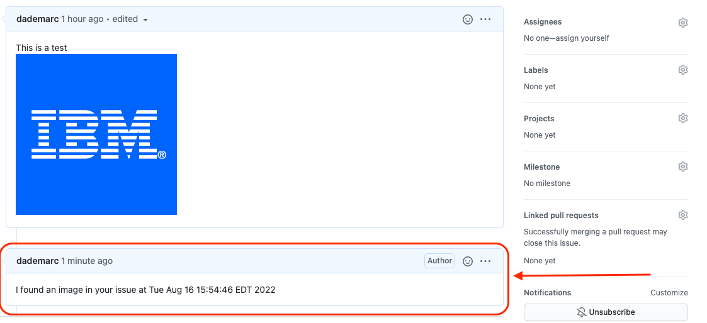

# Github Caption API

## Overview

Create a microservice/api that is can interacts with GitHub. The Service purpose of the service is to find **images in the body of github issues** and then **comment on the issue** That a image was detected with a the date and time.

## Resources

- [Github API Docs](https://docs.github.com/en/rest)
  - **Authenticate with a Personal Access Token**

## Design/Requirements

### Authentication

The API should use **BasicAuth** to protect all routes **except a heath check endpoint**.

### Error Handling

Handle potential errors with correct HTTP status codes and helpful messages indicating the source of the error

### Testing

Write tests where you feel its necessary.

### Structure

- Structure code cleanly
- Create abstractions as you see fit
- Write comments where approriate

### Endpoints

The API should have endpoints that meet these requirements.

```http
Method: GET
Path: /health
```

```json
// Response
200
{
  "status": "OK"
}
```

---

### **Get Issue Information**

```http

Method: GET
Path: /api/v1/github/{owner}/{repo}/issue/{issue_number}
```

```json
// Response
200
{
  "id": <Number>,
  "title": <String>,
  "body": <String>
}
```

---

### **Check if body contains a image**

```http

Method: GET
Path: /api/v1/github/{owner}/{repo}/issue/{issue_number}/image
```

```json
// Response 
200
{
  "containsImage": <Boolean>
}
```

---

### **Post a comment on an Issue**

```http
Method: POST
Path: `/api/v1/github/{owner}/{repo}/issues/{issue_number}/comment`
Body: 
{
  "body":<String>
}
```

```json
// Response
200
{
  "message": "success"
}
```

---

### **Identify Images in Github Issue Body and Comment**

```http
Method: POST
Path: /api/v1/github/{owner}/{repo}/issues/{issue_number}/identify
Body: 
{
  "body": "I found an image in your issue at {date} {time}" 
}
```

```json
// Response
200
{
  "message": "success"
}
```

### Sample of desired outcome


